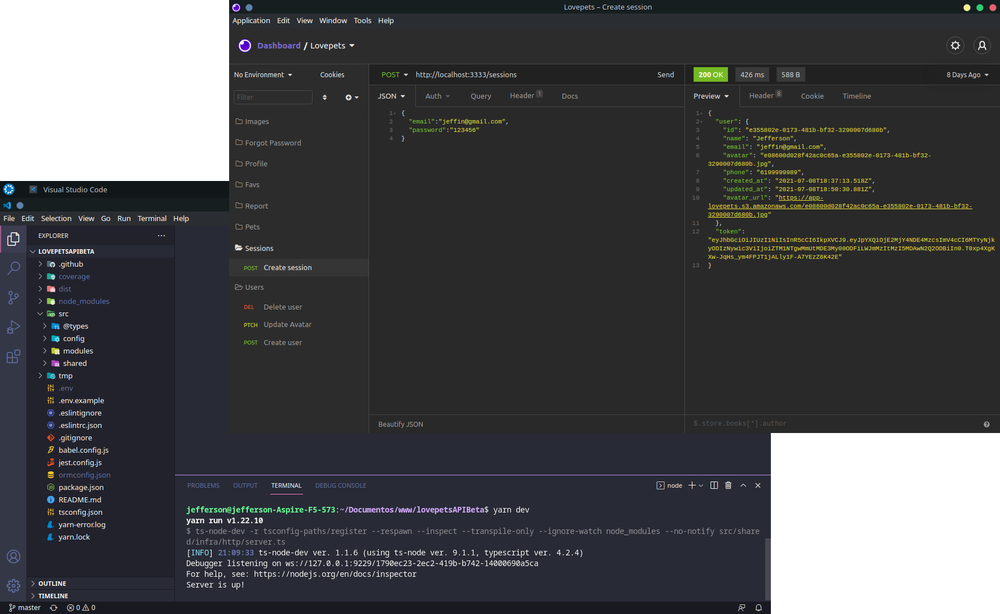

# Love Pets: amor aos animais
<h2 align="center">
 
 Aplicação para conectar pessoas que desejam doar e ou adotar pets 
</h2>

<p align="center">
  
  
  <a href="https://www.linkedin.com/in/jefferson-c-silva-aa1b7b1a9/">
    
  </a>
</p>

<p align="center">
  
</p>

## 💻 Projeto

Love pets: amor aos animais, é um projeto que tem como ideia conectar pessoas que desejam adotar ou doar pets baseado na localidade do usuário. Esse é o backend da aplicação.

## 🚀 Tecnologias

- [Node.js](https://nodejs.org/en/)
- [TypeScript](https://www.typescriptlang.org/)
- [Express](https://expressjs.com/pt-br/)
- [TypeORM](https://typeorm.io/)
- [Docker](https://www.docker.com/)
- [PostgreSQL](https://www.postgresql.org/)
- [Redis](https://redis.io/)
- [JSONWebToken](https://github.com/auth0/node-jsonwebtoken#readme)


## ℹ️ How To Use

Importante ter instalado:

- [Node.js](https://nodejs.org/en/)
- [Yarn](https://classic.yarnpkg.com/) ou [NPM](https://www.npmjs.com/)
- [Docker](https://www.docker.com/)

```bash
# Clone this repository
$ git clone https://github.com/Jefferson00/lovepetsAPIBeta

# Go into the repository
$ cd lovepetsAPIBeta

# Install dependencies
$ yarn install

# Make a copy of '.env.example' to '.env'
# and set with YOUR environment variables.
# The aws variables do not need to be filled for dev environment

# Create the instance of postgreSQL using docker

$ docker run --name lovepets-postgres -e POSTGRES_USER=docker \
              -e POSTGRES_DB=love_pets_beta -e POSTGRES_PASSWORD=docker \
              -p 5434:5432 -d postgres

# Create the instance of redis using docker
$ docker run --name lovepets-redis -p 6379:6379 -d -t redis:alpine

# Once the services are running, run the migrations
$ yarn typeorm migration:run

# To finish,run
$ yarn dev

```

## 📝 License

<a href="/LICENSE">
    
 </a>

Made with ♥ by Jefferson C Silva :wave: [Get in touch!](https://www.linkedin.com/in/jefferson-c-silva)